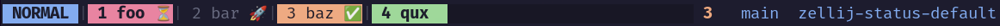
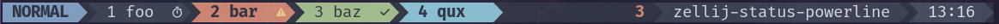
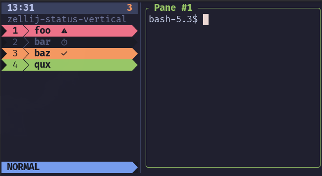
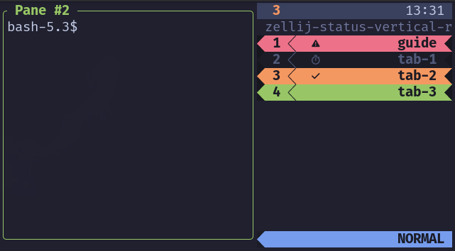

# zellij-status

A Zellij plugin that combines vertical tabs, styled status bars, and
notification tracking into one WASM binary.

Zellij-status unifies ideas from three amazing plugins
([`zjstatus`](https://github.com/dj95/zjstatus),
[`zellij-vertical-tabs`](https://github.com/cfal/zellij-vertical-tabs), and
[`zellij-attention`](https://github.com/KiryuuLight/zellij-attention), a
soft-fork of all three) while supporting both horizontal and vertical layouts
with KDL-only configuration.

## Features

- **Layout modes**: horizontal status bar and vertical sidebar
- **Widgets**: tabs, mode, session, datetime, notifications, swap layout,
  command output, and pipe-fed external status
- **Styling**: format strings with ANSI attributes
  (`#[fg=...,bg=...,bold,fill]`), color aliases, and cap transitions
- **Layout control**: indexed sections, split rows (`_left`/`_right`),
  alignment, and precedence-based hiding on narrow terminals
- **Interaction**: mouse tab switching, scroll navigation, and per-pane
  notifications cleared on focus

## Screenshots

<div align="center">
  <table>
    <tr>
      <td align="center" width="100%">
        
        <br />
        <sub><strong>Horizontal</strong> · default (tokyo night)</sub>
      </td>
    </tr>
  </table>
</div>

<div align="center">
  <table>
    <tr>
      <td align="center" width="100%">
        
        <br />
        <sub><strong>Horizontal</strong> · powerline (nord)</sub>
      </td>
    </tr>
  </table>
</div>

<div align="center">
  <table>
    <tr>
      <td align="center" width="50%">
        
        <br />
        <sub><strong>Vertical</strong> · left sidebar (tokyo night)</sub>
      </td>
      <td align="center" width="50%">
        
        <br />
        <sub><strong>Vertical-right</strong> · right sidebar (tokyo night)</sub>
      </td>
    </tr>
  </table>
</div>

## Installation

### From releases

Download `zellij-status.wasm` from
[GitHub releases](https://github.com/scottames/zellij-status/releases) and place
it in `~/.config/zellij/plugins/`:

```bash
mkdir -p ~/.config/zellij/plugins
curl -fsSL \
  "https://github.com/scottames/zellij-status/releases/latest/download/zellij-status.wasm" \
  -o ~/.config/zellij/plugins/zellij-status.wasm
```

Then reference it in your layout as:

```plaintext
file:~/.config/zellij/plugins/zellij-status.wasm
```

### From source

```bash
cargo build --release --target wasm32-wasip1
# binary: target/wasm32-wasip1/release/zellij-status.wasm
mkdir -p ~/.config/zellij/plugins
cp target/wasm32-wasip1/release/zellij-status.wasm ~/.config/zellij/plugins/
```

## Quick start

Add the following plugin block inside `default_tab_template` in your Zellij
layout file.

- See [`examples`](examples/) for several complete working layouts

```kdl
plugin location="file:~/.config/zellij/plugins/zellij-status.wasm" {
    layout_mode "horizontal"

    color_bg     "#1e1e2e"
    color_fg     "#cdd6f4"
    color_accent "#a6e3a1"

    // format_<row>_<zone>: numbered rows inside left/center/right zones
    format_1_left  "#[fg=$accent,bold]{mode} {tabs}"
    // aggregate notification count across all tabs
    format_2_right "{notifications}"
    format_3_right "#[fg=$fg] {session} "

    // {notification} must be present here for per-tab notification icons to render
    tab_normal "#[fg=$fg] {index}:{name} {notification}"
    tab_active "#[fg=$bg,bg=$accent,bold] {index}:{name} {notification} #[bg=default]"

    // optionally show notification indicators on tabs
    notification_enabled               "true"
    notification_indicator_waiting     "⏳" // emoji work out of the box; Nerd Font glyphs work too
    notification_indicator_in_progress "🔄"
    notification_indicator_completed   "✅"
    // customize per-tab notification icon styling by state
    // fallback icon format when a state-specific format is not set
    notification_format_tab            "{icon}"
    notification_format_waiting        "#[fg=yellow,bold]{icon}"
    notification_format_in_progress    "{icon}" // (aka no format)
    notification_format_completed      "#[fg=$accent,bold]{icon}"
    // optionally restyle the whole tab when a notification is present
    // leave these unset to keep whole-tab overlays disabled
    notification_tab_style_waiting     "#[bg=yellow,fg=$bg,bold]"
    notification_tab_style_in_progress "#[bg=yellow,fg=$bg]"
    notification_tab_style_completed   "#[bg=$accent,fg=$bg]"
    // customize the format for the notification count
    notification_format                "#[fg=$accent,bold] {count} "
    // hide the aggregate counter when there are no notifications
    notification_show_if_empty         "false"
}
```

Mental model for the snippet above:

- `format_*` keys place widgets into the bar
- `tab_*` keys control how each tab looks
- `notification_format_*` keys style the per-tab icon only
- `notification_tab_style_*` keys optionally restyle the whole tab
- `{notifications}` shows the aggregate count; `{notification}` shows the
  per-tab state

<!-- prettier-ignore-start -->

> [!NOTE]
> Need more than the quick start?
>
> - [`docs/advanced-features.md`](./docs/advanced-features.md) deeper
>   examples and behavior notes
> - [`docs/config-reference.kdl`](./docs/config-reference.kdl)
>   generated key-by-key config reference

<!-- prettier-ignore-end -->

Per-tab `{notification}` formatting uses `notification_format_*` keys and
supports `{icon}` as a placeholder.

Whole-tab notification overlays use `notification_tab_style*` keys. They are
opt-in: if you leave those keys out, tabs keep their existing styling and only
the `{notification}` fragment changes. When configured, overlays apply only to
inactive tabs by default so the active-tab style remains the primary focus
signal; set `notification_tab_style_apply_to_active` to `"true"` if you want
active tabs to restyle as well.

<!-- prettier-ignore-start -->
> [!TIP]
> Want to add more visual flair? Try some [Nerd Fonts](https://www.nerdfonts.com/)
> (for tabs, status segments, notifications, etc).
<!-- prettier-ignore-end -->

On first run, Zellij prompts for plugin permissions:

- `ReadApplicationState`
- `ChangeApplicationState`
- `ReadCliPipes`

<!-- prettier-ignore-start -->
> [!IMPORTANT]
> Layout specific gotchas:
>
> - For _horizontal_ layouts, omit `new_tab_template` — Zellij falls back to
> `default_tab_template` automatically.
> - For _vertical_ layouts, define `new_tab_template` with `pane command="bash"`
> as the content pane (see the vertical examples).
<!-- prettier-ignore-end -->

## Examples

Each profile under `examples/` is self-contained (`config.kdl` + `layout.kdl`):

| Profile           | Layout     | Description                                                         |
| ----------------- | ---------- | ------------------------------------------------------------------- |
| `minimal/`        | horizontal | Bare-minimum starter: mode, tabs, session, notifications            |
| `default/`        | horizontal | Full feature showcase with split sections, command and pipe widgets |
| `powerline/`      | horizontal | Powerline tab styling with caps and fill behavior                   |
| `vertical/`       | vertical   | Left sidebar with top/middle/bottom zones and overflow indicators   |
| `vertical-right/` | vertical   | Right sidebar mirror of `vertical/` with reversed cap direction     |

Run an example from a local clone:

```bash
git clone https://github.com/scottames/zellij-status.git
cd zellij-status
cargo build
EXAMPLE="default"
zellij \
  -s "zellij-status-${EXAMPLE}" \
  --config-dir "./examples/${EXAMPLE}" \
  --config "./examples/${EXAMPLE}/config.kdl" \
  -n "./examples/${EXAMPLE}/layout.kdl"
```

With [mise](https://mise.jdx.dev/) (build + run):

```bash
mise run example <profile>
```

For an interactive walkthrough, see `examples/GUIDE.txt`. (also launched in each
of the examples)

For advanced customization details and the full generated config reference, see
the links in the quick start section above.

## Acknowledgments

This Frankenstein plugin is a soft-fork of the three excellent Zellij plugins:

- [zjstatus](https://github.com/dj95/zjstatus) by Daniel Jankowski - format
  engine, widget system, horizontal bar rendering
- [zellij-vertical-tabs](https://github.com/cfal/zellij-vertical-tabs) by Alex
  Lau - vertical tab layout and mouse navigation
- [zellij-attention](https://github.com/KiryuuLight/zellij-attention) by
  KiryuuLight - pipe-based per-pane notification tracking

Many thanks to them for their hard work. Please check them out; give them much
❤️ and 🌟.

## Contributing

See [CONTRIBUTING.md](CONTRIBUTING.md) for build instructions, testing, and how
to submit changes.

## License

[MIT](LICENSE)
